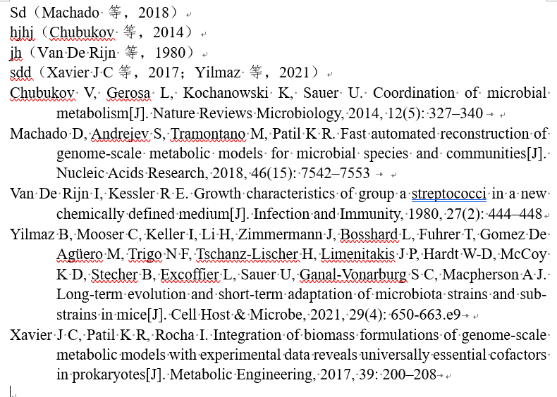

# Zju Env & Res Reference for Zotero
鉴于环资奇奇怪怪的参考文献引用要求，在前人的基础上改了一个符合引用要求的插件
___

## 使用方法
下载zju-Env & Res.csl导入zotero即可

## 功能
对于文中引用
1. 引用格式为“作者姓氏，出版年”，英文仅写姓氏（有时候不止一个词，不知道为啥）
2. 实现统一中文括号、中文分号，“等”后面中文逗号。用中文符号后面均无需加
空格
3. 多篇文章用分号隔开

对于文末参考文献格式
1. 参考文献排序按照作者的姓氏字母顺序排序，先中文引文，后英文引文
2. 外文文献名第一个词首字母大写，其余为小写
3. 期刊名实词的第一个字母大写
4. 不需要 DOI
5. 统一列出所有期刊作者名称

效果图如下：

___
没试过中文期刊，并且可能存在其他bug，请联系作者修改